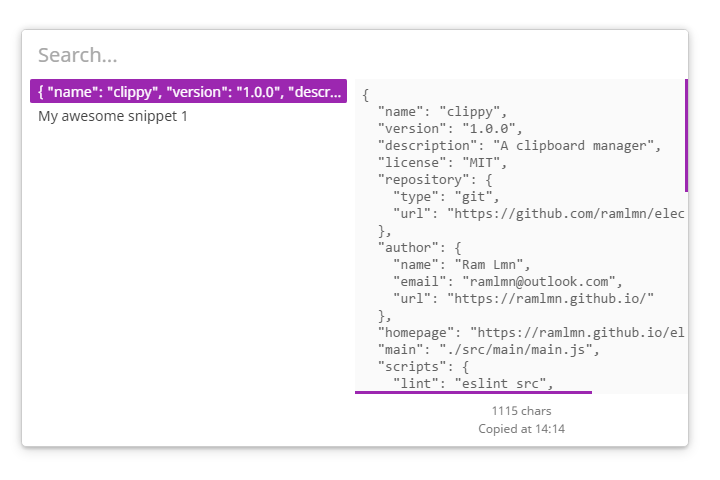
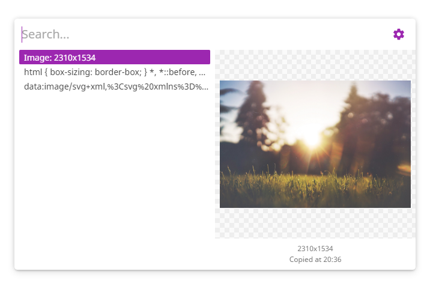

# Clippy
A clipboard manager built on [electron](https://github.com/electron/electron/), using [WebComponents](https://developer.mozilla.org/en-US/docs/Web/Web_Components)

## Installation
> **Note:** Pre-built [binaries](releases) are available for Windows only

Clone the repo and install dependencies
```
$ git clone https://github.com/ramlmn/clippy.git
$ cd clippy
$ npm i
```

For running the application from console:
```
$ npm start
```

For building a binary:
```
$ npm run build
```
The binary(for your platform) would be available in `dist` directory

## Usage
The app is still in beta and doesn't have a feature to customize anything.
The app would be running in the system tray and can be accessed by the keyboard shortcut: `Ctrl+Shift+V` or `Cmd+Shift+V`

## Acknowledgements
* UI inspired from [Alfred app](https://www.alfredapp.com/)
* Custom elements source inspired from [Polymer](https://github.com/Polymer/polymer)
* Installer icon inspired from icon made by [Roundicons](http://www.flaticon.com/authors/roundicons) from [www.flaticon.com](http://www.flaticon.com) is licensed by [CC 3.0 BY](https://creativecommons.org/licenses/by/3.0/) (_modified_)

## Screenshots



## License
[MIT](LICENSE)
