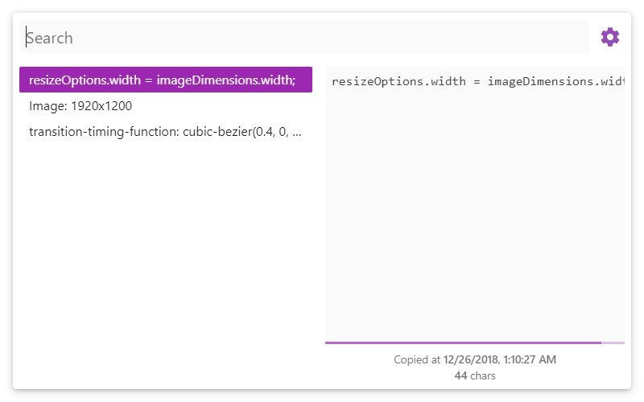
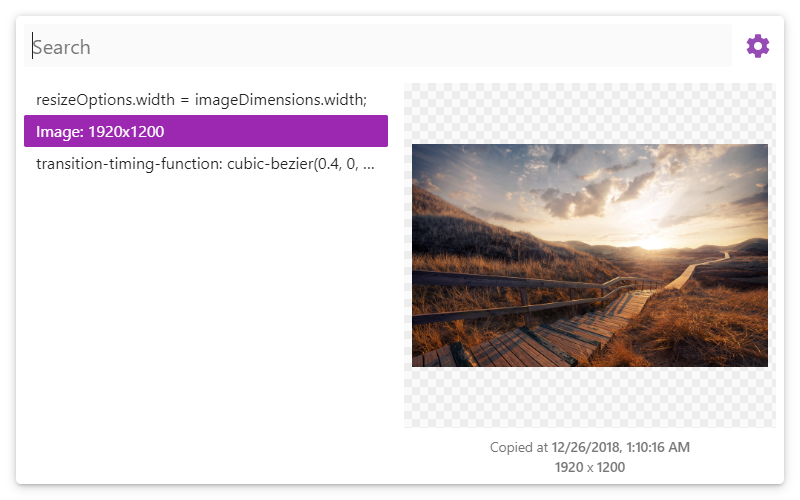
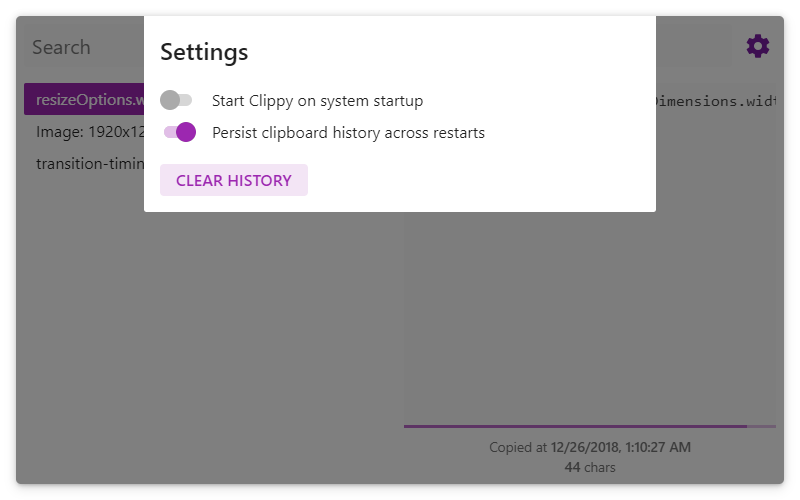

<h1 align="center">
   
  
   
   
</h1>

# Clippy

> A simple clipboard manager built on [electron](https://github.com/electron/electron/)

## Screenshots

## Installation

Prebuilt images can be found on the [releases](https://github.com/ramlmn/electron-clippy/releases/latest) page

## Usage/features

- Persistent data storage across restarts (disabled by default)
- Delete individual items using the <kbd>Delete</kbd> key
- Clear whole clipboard at once
- Bring the app to forground the keyboard shortcut <kbd>Ctrl/Command</kbd> + <kbd>Shift</kbd> + <kbd>V</kbd>

## License
[MIT](LICENSE)
